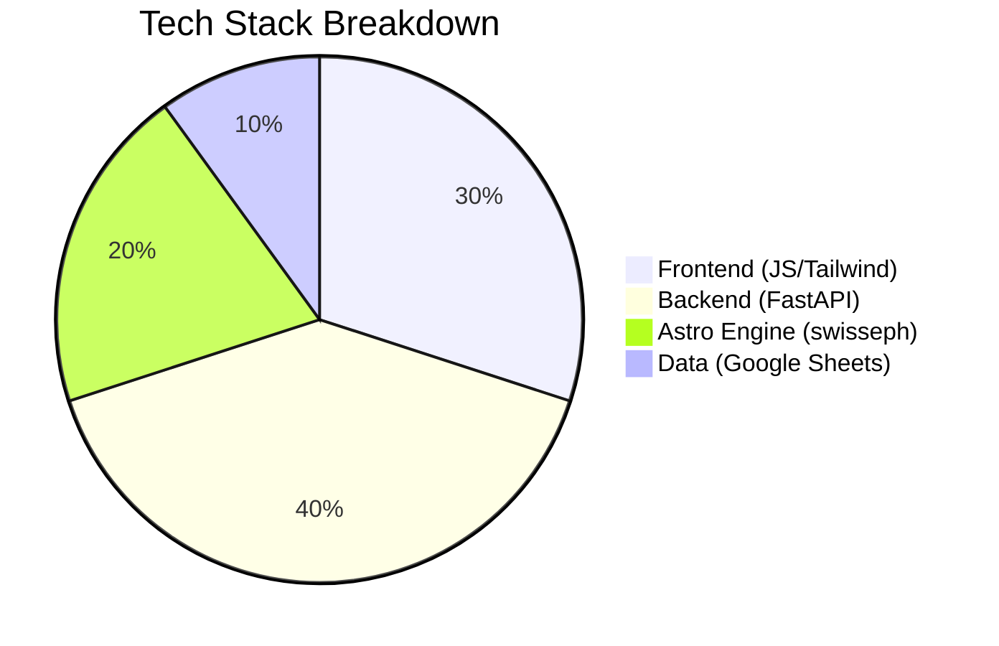

# Natal Astro - Overview

## 🌌 Project Purpose
A web-based tool that calculates **Vedic astrological birth charts** (Kundali) by:
- Processing user birth details (date, time, location)
- Computing planetary positions using Swiss Ephemeris  
- Generating reports with Lagna, Nakshatra, and Panchang elements

## ✨ Key Features
| Feature | Description | Tech Used |
|---------|-------------|-----------|
| Dynamic Location Selector | Country → State → City dropdowns | Google Sheets API + Vanilla JS |
| Astro Calculations | 30+ Sahams, planetary positions | Swiss Ephemeris (swisseph) |
| Data Management | Input/Output via Google Sheets | Sheets API |
| Responsive UI | Mobile-friendly forms | Tailwind CSS |

## 🎯 Target Audience
1. **Astrology Enthusiasts**: Get accurate birth charts  
2. **Developers**: Extend with new calculation methods  
3. **Researchers**: Study astrological data patterns  

## 🛠️ Technical Stack

## 📈 Core Workflow
1. **User Input**  
   - Submits birth details via form  
   - Selects location from dynamic dropdowns  

2. **Backend Processing**  
   - Converts local time to Julian Day  
   - Computes planetary positions  
   - Generates CSV/HTML report  

3. **Output**  
   - Stores input in Google Sheets  
   - Returns interactive chart visualization  

---

### Why Choose Natal Astro?
✅ **Precise Calculations**: Uses Swiss Ephemeris (gold standard)  
✅ **No Database Needed**: Leverages Google Sheets as storage  
✅ **Customizable**: Easily add new Sahams or calculation methods  

---

> Next Steps:  
> - [Setup Guide](setup/): Get the project running locally  
> - [Architecture Deep Dive](architecture/): Understand system design  