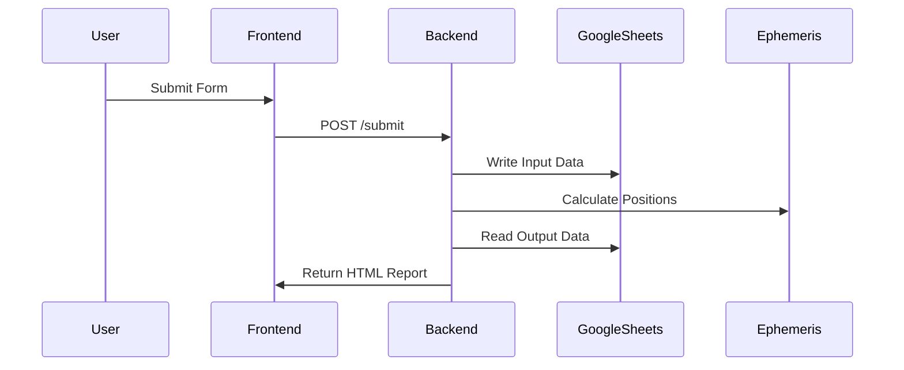

# 🌊 Data Flow

## Critical Path


## Phase Details
### 1. Input Phase
- **Data Collected**:
  ```python
  {
    "name": "John Doe",
    "datetime": "1990-05-15 08:30",
    "latitude": 19.0760,
    "longitude": 72.8777
  }
  ```
- **Validation**:
  - Date format (YYYY-MM-DD)
  - Coordinates within valid ranges (-90 to +90, -180 to +180)

### 2. Processing Phase
- **Steps**:
  1. Convert local time to Julian Day
  2. Compute Lagna (ascendant)
  3. Calculate planetary positions
  4. Determine Sahams

### 3. Output Phase
- **Google Sheets**:
  - Input tab: Raw user data
  - Output tab: Calculated astro values
- **User**:
  - HTML report with tables/charts
  - Option to download CSV

## Performance Bottlenecks
1. Swiss Ephemeris calculations (~300ms/chart)
2. Sheets API latency (~200ms/operation)
````

---

### **Directory Structure**
```
3-Architecture/
├── README.md         # Overview
├── Frontend.md       # UI components
├── Backend.md        # Service layers
└── Data-Flow.md      # Sequence diagrams
