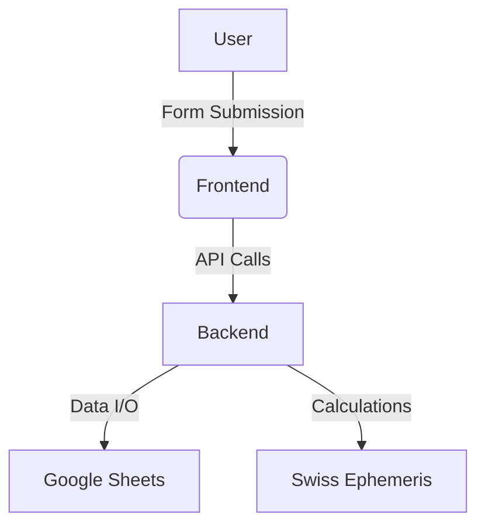

# 🏛️ System Architecture

## Core Components
1. **[Frontend](Frontend.md)** - User interface and client-side logic  
2. **[Backend](Backend.md)** - API services and astro-calculations  
3. **[Data Flow](Data-Flow.md)** - End-to-end processing sequence  

## Architectural Diagram

[▶️ Interactive Diagram](https://example.com/architecture-diagram) *(placeholder link)*
