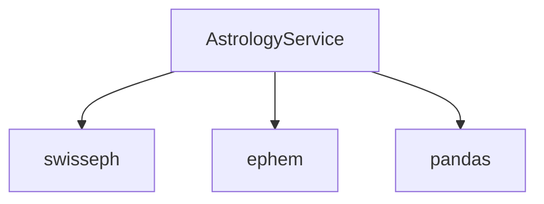

# ♐ AstrologyService

## Core Responsibilities
- Birth chart calculation (Kundali)  
- Planetary position computation  
- Saham (special point) derivations  

## Key Methods
### `calculate()`
**Flow**:
```python
def calculate(self) -> Dict:
    self.jd_utc = self._calculate_julian_day()  # 1. Time conversion
    self.lagna = self._calculate_lagna()        # 2. Ascendant
    return {
        'lagna': self.lagna,
        'planets': self._calculate_planetary_positions(),
        # ... other elements ...
    }
```

### `_calculate_panchang()`
**Input/Output**:
| Parameter | Type | Description |
|-----------|------|-------------|
| `self.jd_utc` | `float` | Julian Day (UTC) |
| **Returns** | `Dict` | `{'Tithi': 'Shukla 7', 'Nakshatra': 'Rohini', ...}` |

**Code Snippet**:
```python
moon_long = swe.calc_ut(self.jd_utc, swe.MOON)[0]
tithi_index = int((moon_long[0] - sun_long[0]) % 360 / 12) + 1
return {'Tithi': TITHI_NAMES[tithi_index]}
```

## Constants
Defined in `astrology_constants.py`:
- `NAKSHATRA_NAMES`: 27 lunar mansions  
- `SENSITIVE_POINTS`: 30+ special formulas  

## Dependencies


**See Also**:  
- [API Sequence Diagram](../3-Architecture/Data-Flow.md#critical-path)  
- [Testing Approach](../6-Testing.md#astrology-calculations)  