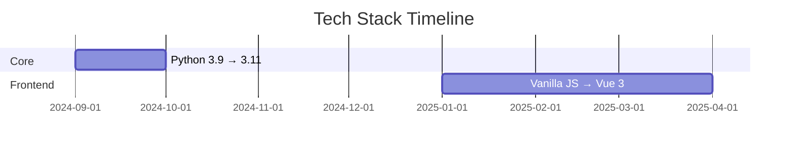

# 🗺️ Development Roadmap

## Q3 2024
✅ **Completed**  
- [x] V1.0: Basic chart generation  
- [x] V1.1: Location auto-complete  

## Q4 2024
🛠️ **In Progress**  
- [ ] V1.5: User accounts (60% complete)  
- [ ] V1.6: PDF report export  

## 2025 Pipeline
🔜 **Planned**  
| Feature | Status | Target Release |
|---------|--------|----------------|
| Mobile App | Research | Q2 2025 |  
| Transit Charts | Design | Q3 2025 |  
| AI Interpretations | Proposal | Q4 2025 |  

## Technology Upgrades

---

## Contribution Guidelines
1. **Branch Naming**: `feat/description` or `fix/issue-number`  
2. **PR Requirements**:
   - 90%+ test coverage
   - API documentation updates
3. **Review Process**:
   - 2 approvals required
   - CI pipeline must pass

**Get Involved**:  
- Join our [Developer Discord](https://discord.gg/natal-dev) *(placeholder)*  
- Check `GOOD_FIRST_ISSUE` labeled tickets  